# task-manager
Command-Line Task Manager (Code Python)
## Description
A simple Python program to manage tasks:
- Add tasks
- View tasks
- Mark tasks as done
- Exit
- Save tasks in a JSON file

## Usage
`python tasks.py` and follow the menu options.

## Screenshots
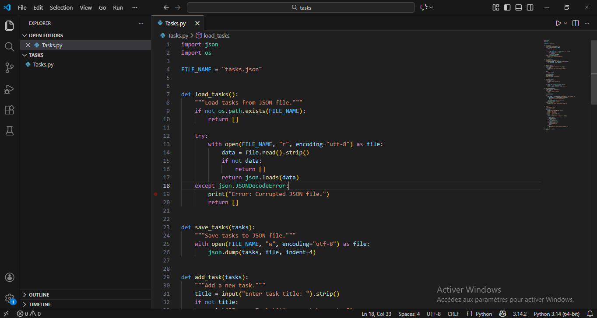
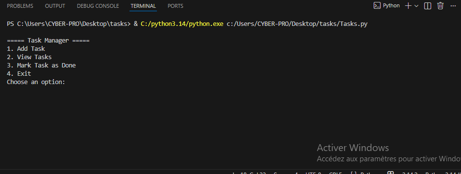
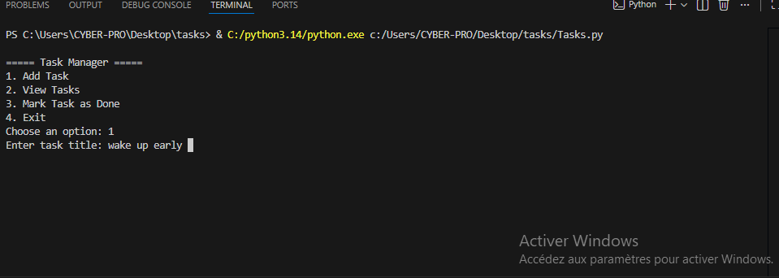
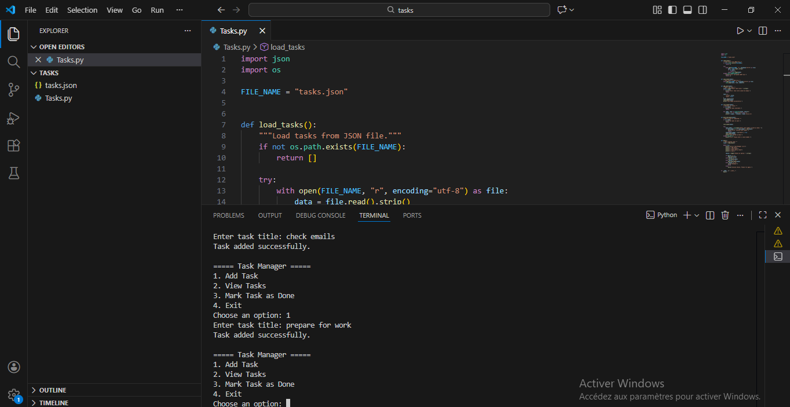
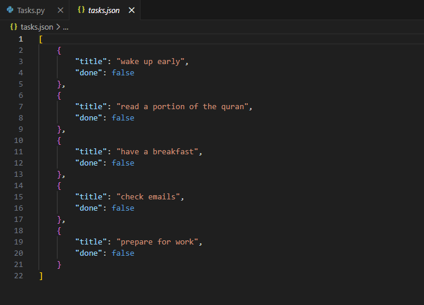
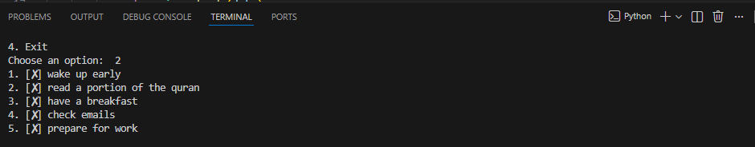
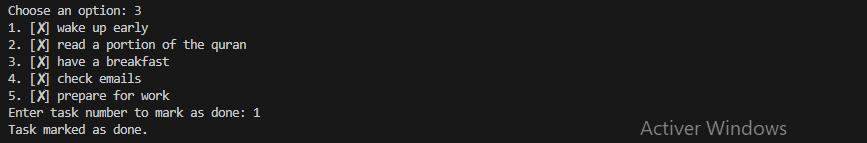
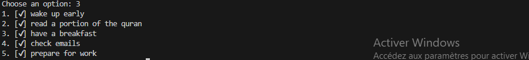
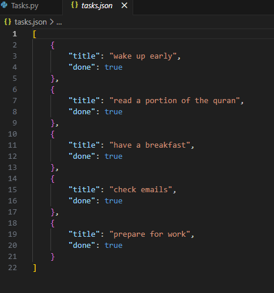
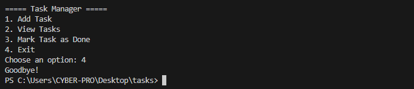
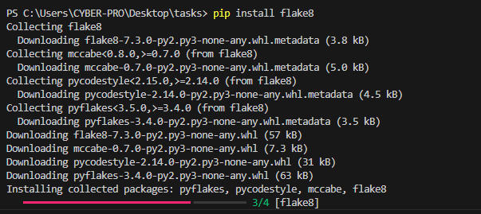
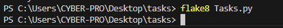
